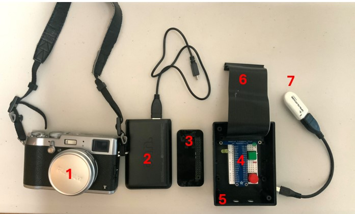
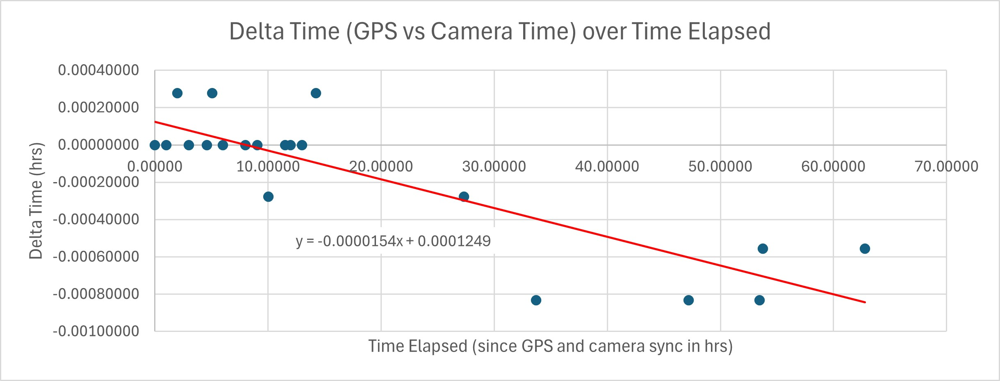

# Geotagger for Camera Using Raspberry Pi, Version 2
by G Rivera

## Intro
This is the second iteration of the geotagger for my Fuji X100T camera using a Raspberry Pi (RPi). Check out this [link](https://github.com/grsrivera/Geotagger-for-Camera-with-Raspberry-Pi) if you want to see the first version. The difference with this design is I don't physically link the camera to the RPi; the camera and RPi operate independently with the location of the photos being saved to the EXIF later on using time data. It makes for a more portable and convenient setup as I don't have to carry a hot shoe adapter and cable around when shooting. It also means that multiple cameras can be used simultaneously with the geotagger as all that is needed is the time the photo was taken to identify its geotag from the list.

[Video Demo](https://youtu.be/sT2KrxCJu0k)

## How It Works
This geotagger works by recording the user's location every second while shooting then saving that data to a .pkl file. Pictures are taken normally with the camera. In post-processing, the times the photos were taken are used to match the corresponding location to its photo before populating the data to the EXIF.

## Description

### Installation Requirements
    pip install pyserial    
I used PySerial to read the USB GPS module.

    pip install RPi.GPIO
This is required on the script that is run on the RPi to interact with the general-purpose input/output (GPIO) pins.

    pip install piexif
This is required to add the location of the metadata.

### Hardware

  

1. Fuji X100T Camera
2. Portable Battery
3. Raspberry Pi Zero WH
4. Breadboard and Wires (for LED indicators and buttons to start/stop code)
5. Plastic Enclosure
6. Ribbon cable (to connect RPi to breadboard)
7. u-blox 7 GPS Receiver

### Code
The system uses two scripts: 
**1. geotagger.py:** This is run by the RPi to create a a list of locations taken each second while shooting that are then saved to a .pkl file.

**2. exif.py:** After transferring the .pkl file and photos to a computer, this program finds the corresponding geotag in the .pkl file then populates the photo EXIF.

#### geotagger.py
This script logs time, latitude, longitude, and altitude data from the u-blox GPS module every second. The u-blox outputs several messages in [National Marine Electronics Association (NMEA)](https://www.sparkfun.com/datasheets/GPS/NMEA%20Reference%20Manual-Rev2.1-Dec07.pdf) format constantly. This program pulls time from the GPRMC message and latitude, longitude, and altitude from the GPGGA message. When the red "Stop" button is pressed, data collection is stopped and the raw data from the u-blox is saved to a .pkl file. The .pkl files are saved according to Greenwich Mean Time (GMT) date, i.e., if the shoot runs through 1700 Pacific Standard Time (or 0000 GMT), for example, two .pkl files will be saved to reflect the change of day. This is done to facilitate the matching of geotags to photos in exif.py.

#### File Transfer 
The photos and .pkl file need to be transferred to a computer after shooting. I transferred the photos using an SD card. There are several options for transferring files from a RPi to a computer, but the easiest method I found was using WinSCP.

#### exif.py
This program goes through each photo one-by-one, finds the corresponding geotag, then populates the EXIF. It first converts the "Time Taken" data of the photo from local (I prefer to set my camera to local time) to GMT. The script prompts the user for the time zone difference from GMT. That time is then used to search the .pkl files for the corresponding geotag. The data is converted from degrees-decimal-minutes (DDM), the output of the u-blox, to degrees-minutes-seconds (DMS), the necessary input for EXIF location. Then each GPS fix is added to the corresponding picture with piexif. Geotag data could be missing either because 1) The u-blox did not get the time from GPS satellites and/or 2) the u-blox did not have coverage from the minimum four GPS satellites to get a good positional fix. The printout of the script will provide a message explaining why the photo could not be geotagged.

<h4 style="margin-left: 20px">Time Error</h4>

The camera is not connected to the RPi or u-blox and cannot be programmatically synced up to GMT, thus there will always be a delta time between the camera and GMT. This effect is mitigated by manually syncing the camera to GMT before use. The user will need to input the time the camera was synced when exif.py is run. Additionally, exif.py accounts for the error by using the best-fit line of a scatterplot I made for my Fuji X100T camera by recording the time difference over three days. Below is the graph of the delta time for my camera.  
  
As you can see, the drift is minor with the camera increasing by a second faster per day. This is negligible considering there will be other geotags around the time the picture was taken that will be close enough to the correct time. However, if the photographer is moving fast, for instance, if they are in a car or plane, that second could amount to a large error in distance. For example, a geotag one second off when the photographer is in a car moving 60mph results could be a geotag that is 88ft away from the correct location. The drift may also have a significant effect if the photographer is unable to sync the camera to GPS time for several days. This was the case in the video demo when we were unable to sync our cameras to GMT in Yosemite.

### How to Use
**1. Set up the RPi to run geotagger.py on boot-up.** I did this by using crontab. This is a good [video](https://www.youtube.com/watch?v=Gl9HS7-H0mI) on how to do this.
 
**2. Sync the camera to GMT.** I did this by pulling up GMT on my u-blox then setting my camera to one minute ahead on the "Date and Time" settings page. At the top of the minute, I saved the time. This was the best method I could find as there is no way to set seconds on the Fuji X100T. 
**3. Turn on the RPi once you're ready to take pictures.** The program will start recording location data every second, indicated by the solid green LED light. 
 
**4. Take pictures as you normally would.** 
 
**5. Save the data.** The geotags have only been appended to a Python list at this point but not saved. Pressing the red button will stop the program and save the information to a .pkl file. If the photographer wants to continue collection again, pushing the green button will resume operation. To shut down the program, the photographer can hold down the red and green buttons together before removing power to the RPi.
**6. Transfer photos to computer.** My camera saves photos to an SD card, which I plugged into my laptop and transferred. The photos can be dropped anywhere on the computer but the folder path needs to be reflected in exif.py.
 
**7. Transfer .pkl file.** I used WinSCP for this. Download the installer from [here](https://winscp.net/eng/index.php). This is a good [video](https://www.youtube.com/watch?v=egiafV1Iy_E) to follow along with if it's your first time using the software. The file can be dropped anywhere again, but ensure it is reflected in exif.py
 
**8. Run exif.py.** The EXIF data gets populated with a printout for each photo.

### Limitations
**1. Satellite Coverage:** As with any system that requires GPS satellite input, the accuracy of the data or even the existence of the data at all will depend on if line-of-sight can be maintained between the u-blox module and at least four satellites. 
**2. Error Accuracy:** This geotagger can be used with any camera; however, every camera will have its own delta time with GMT, and exif.py only accounts for my Fuji X100T's delta time. For a different camera to be used, a scatterplot of its delta time must be made then the best-fit line applied to exif.py. Or, which is what I did with my brother's photos in the picture, comment out the delta time block of exif.py and accept that there will be error. But as mentioned above in the "Time Error" section, I would only be concerned with this if my brother had taken pictures in a car or if we had been out hiking for several more days without syncing to GPS time.

## Contact
Thanks for reading this. If you have questions, please reach out at gerald.rivera@gmail.com.